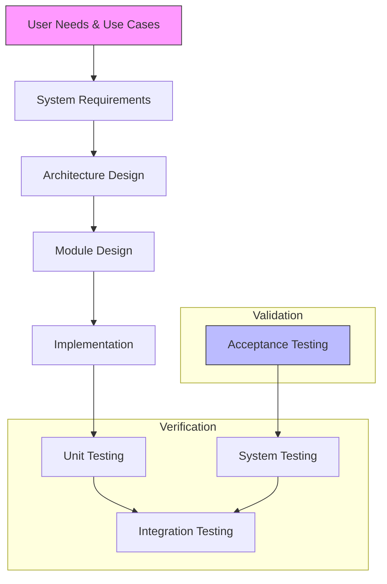

# 10_Testing_Validation_and_QMS.md

# Master Testing, Validation, and Quality Management Plan

**Priority:** P0 (Critical for Regulatory Approval)  
**Status:** Consolidated Master Plan  
**Related Standards:** IEC 62304, ISO 14971, FDA 21 CFR Part 820, IEC 62366

---

## 1. Executive Summary
This document consolidates all testing, validation, and quality assurance strategies for the Medical Device Platform SDK. It replaces fragmented testing notes found in individual module specs and risk assessments with a unified V-Model approach required for Class II/III medical device software certification.

### 1.1 Objectives
- Ensure traceability from User Needs → Requirements → Design → Implementation → Testing.
- Define automated vs. manual testing boundaries.
- Establish acceptance criteria for regulatory submission (FDA 510(k)/PMA, CE MDR).
- Integrate CI/CD quality gates with QMS documentation.

---

## 2. The V-Model Lifecycle

---

## 3. Testing Levels & Strategies

### 3.1 Level 1: Unit Testing (Developer Level)
**Target:** Individual functions, classes, and drivers.  
**Coverage Goal:** ≥90% line coverage, ≥80% branch coverage for Safety Class C components.

| Component Type | Framework | Frequency | Owner |
| :--- | :--- | :--- | :--- |
| C/C++ Core Libraries | GoogleTest / CMocka | On Commit | SDK Devs |
| Python Bindings | Pytest | On Commit | SDK Devs |
| Kernel Drivers | KUnit / LTP | Nightly | BSP Team |
| HAL Abstractions | Custom Harness | On Commit | HAL Team |

**Key Requirements:**
- All unit tests must run in < 5 minutes locally.
- Mocking required for hardware dependencies (e.g., camera sensors, GPU).
- Static Analysis (Coverity/SonarQube) must pass zero critical issues.

### 3.2 Level 2: Integration Testing (Subsystem Level)
**Target:** Interaction between modules (e.g., Camera HAL → ISP → AI Inference).  
**Focus:** Interface contracts, data flow, resource contention.

| Integration Scenario | Test Method | Tools |
| :--- | :--- | :--- |
| Camera Pipeline | Synthetic Data Injection | GStreamer Test Suite |
| AI Inference Engine | Model Accuracy Regression | ONNX Runtime Test Bench |
| Display Rendering | Frame Latency Measurement | FrameScope / Custom Scripts |
| Security Boot Chain | Fault Injection | Hardware JTAG / U-Boot Console |

### 3.3 Level 3: System Testing (Full Platform)
**Target:** Complete QCS8550 + Linux system under load.  
**Environment:** Reference Hardware Board.

- **Performance Testing:** 
  - Boot time (< 5s to UI ready).
  - AI Inference latency (p99 < 30ms for detection models).
  - Thermal throttling behavior under sustained load.
- **Stress Testing:** 
  - 72-hour continuous operation loop.
  - Memory leak detection (Valgrind/KASAN).
- **Security Testing:** 
  - Penetration testing on network interfaces.
  - Secure boot bypass attempts.

### 3.4 Level 4: Acceptance & Clinical Validation
**Target:** Real-world clinical scenarios (See `09_Use_Cases_and_Applications.md`).  
**Method:** Usability testing with simulated clinical workflows.

- **Usability Engineering (IEC 62366):** Formative and Summative evaluations.
- **Clinical Simulation:** Using phantom data and recorded surgical videos.
- **Interoperability:** DICOM conformance statement testing against hospital PACS.

---

## 4. Automated CI/CD Pipeline (Quality Gates)

The CI/CD pipeline (`06_Developer_Tooling_and_CI_CD.md`) enforces the following gates:

| Stage | Gate Criteria | Action on Failure |
| :--- | :--- | :--- |
| **Pre-Commit** | Linting, Format Check | Block Commit |
| **Build** | Compilation Success, SBOM Generation | Block Merge |
| **Test** | Unit Test Pass, Coverage Threshold | Block Merge |
| **Scan** | CVE Scan (No Critical/High), License Check | Alert / Block Release |
| **Deploy** | Integration Test Pass on Emulator | Deploy to Staging HW |
| **Release** | Manual QA Sign-off, Regulatory Doc Gen | Tag Release Candidate |

---

## 5. Defect Management & Traceability

### 5.1 Defect Classification
Aligned with IEC 62304 Software Problem Report categories:
- **Critical:** Potential for patient death or serious injury (System crash, wrong dosage calc).
- **Major:** Significant degradation of function (Image artifact, slow response).
- **Minor:** Nuisance, no impact on safety (UI typo, non-critical log error).

### 5.2 Requirements Traceability Matrix (RTM)
Every test case must link back to a specific Requirement ID.
- Format: `TEST-ID` ↔ `REQ-ID` ↔ `RISK-ID`
- Tooling: Managed via `scripts/generate_rtm.py` outputting to Excel/CSV for auditors.

---

## 6. Validation Deliverables for Regulatory Submission

The following artifacts will be generated for the Design History File (DHF):

1.  **Software Validation Plan (SVP):** This document.
2.  **Software Validation Report (SVR):** Summary of all test results, deviations, and residual risks.
3.  **Traceability Matrix:** Full bidirectional traceability.
4.  **Anomaly List:** Known issues with risk justification for non-fixes.
5.  **Revision History:** Detailed changelog of software versions.

---

## 7. Roles and Responsibilities

| Role | Responsibility |
| :--- | :--- |
| **QA Manager** | Approves Validation Plan/Report, Audits Process |
| **Dev Lead** | Ensures Unit/Integration tests are written |
| **Test Engineer** | Executes System/Acceptance tests, manages lab hardware |
| **Regulatory Affairs** | Reviews deliverables for FDA/CE compliance |

---

## 8. References
- `01_Medical_Grade_Definition.md` (Safety Classes)
- `06_Developer_Tooling_and_CI_CD.md` (Pipeline Implementation)
- `08_Risk_Mitigation_and_Validation.md` (Risk Inputs)
- `09_Use_Cases_and_Applications.md` (Validation Scenarios)
