# Regulatory Mapping

This document provides a comprehensive cross-reference matrix mapping international medical device standards and regulations to specific SDK features, implementation strategies, and required certification artifacts.

## 1. Standards Cross-Reference Matrix

### 1.1 Software Lifecycle & Quality Management (IEC 62304 + ISO 13485)

| Standard Clause | Requirement Summary | SDK Implementation Feature | Verification Method | Status |
|-----------------|---------------------|---------------------------|---------------------|--------|
| **IEC 62304 §5.1** | Software Development Planning | `SDK_CONFIG` build profiles, phase-gated CI/CD pipelines | Audit trail in Jenkins/GitLab CI | ✅ Implemented |
| **IEC 62304 §5.2** | Requirements Analysis | YAML-based requirement specs with auto-traceability to tests | RTM generation via `sdk-cli trace` | ✅ Implemented |
| **IEC 62304 §5.3** | Architectural Design | Layered architecture (HAL → Core → Modules), interface contracts | Architecture review checklist, static analysis | ✅ Implemented |
| **IEC 62304 §5.4** | Detailed Design | Module-level design docs, UML sequence diagrams | Peer review + model checking | 🔄 In Progress |
| **IEC 62304 §5.5** | Implementation & Unit Testing | GoogleTest framework, ≥90% code coverage enforcement | Coverage reports in CI, mutation testing | ✅ Implemented |
| **IEC 62304 §5.6** | Integration Testing | Hardware-in-the-Loop (HIL) test benches, mock HAL for x86 | Automated integration test suites | ✅ Implemented |
| **IEC 62304 §5.7** | System Testing | End-to-end clinical workflow validation, performance benchmarks | Validation protocols per use case | 🔄 In Progress |
| **IEC 62304 §6** | SOUP (Software of Unknown Provenance) | SBOM generation (CycloneDX), vulnerability scanning, patch SLA | `sdk-cli sbom`, Dependabot integration | ✅ Implemented |
| **IEC 62304 §7** | Release & Maintenance | Semantic versioning, change control board workflow, OTA updates | Release notes generator, rollback mechanism | ✅ Implemented |
| **ISO 13485 §7.3** | Design & Development Control | Phase-gate reviews, design history file (DHF) automation | DHF export tool, audit trail | 🔄 In Progress |

### 1.2 Risk Management (ISO 14971:2019)

| Standard Clause | Requirement Summary | SDK Implementation Feature | Verification Method | Status |
|-----------------|---------------------|---------------------------|---------------------|--------|
| **ISO 14971 §4** | Risk Management Process | Risk management plan template, automated hazard logging | Plan review, process audit | ✅ Implemented |
| **ISO 14971 §5** | Risk Analysis | FMEA/FTA templates, hazard library (clinical, electrical, cyber) | `sdk-cli risk analyze` command | ✅ Implemented |
| **ISO 14971 §6** | Risk Evaluation | Risk acceptance criteria matrix (severity × probability) | Configurable thresholds in SDK | ✅ Implemented |
| **ISO 14971 §7** | Risk Control | Safety architecture patterns, watchdog timers, fail-safe defaults | Fault injection testing | ✅ Implemented |
| **ISO 14971 §8** | Residual Risk Assessment | Benefit-risk analysis framework, residual risk report generator | Clinical evaluation input | 🔄 In Progress |
| **ISO 14971 §9** | Risk Management Report | Auto-generated RMF from hazard logs and test results | `sdk-cli risk report` | ✅ Implemented |
| **ISO 14971 §10** | Production & Post-Market Surveillance | Telemetry hooks, adverse event logging, field data collection | Integration with QMS systems | 🔄 In Progress |

### 1.3 Electrical Safety & EMC (IEC 60601-1 Series)

| Standard Clause | Requirement Summary | SDK Implementation Feature | Verification Method | Status |
|-----------------|---------------------|---------------------------|---------------------|--------|
| **IEC 60601-1 §8** | Protection against electric shock | Isolated I/O drivers, leakage current monitoring APIs | Isolation testing, hipot tests | ✅ Implemented |
| **IEC 60601-1 §11** | Dependency on power supply | Brownout detection, UPS integration hooks, graceful shutdown | Power failure simulation | ✅ Implemented |
| **IEC 60601-1-2** | EMC requirements | ESD protection guidelines, shielding design patterns, filter recommendations | Pre-compliance EMC testing | 🔄 In Progress |
| **IEC 60601-1-6** | Usability engineering | UI safety patterns, alarm management, user error prevention | Formative/summative usability studies | 🔄 In Progress |
| **IEC 60601-1-8** | Alarm systems | Priority-based alarm framework, auditory/visual alarm standards | Alarm accuracy testing | ✅ Implemented |
| **IEC 60601-2-XX** | Particular standards (e.g., endoscopy, infusion) | Module-specific compliance packs (DICOM, pump control, etc.) | Domain-specific validation | 🔄 In Progress |

### 1.4 Cybersecurity (FDA Guidance 2023 + EU MDR Annex I)

| Standard/Regulation | Requirement Summary | SDK Implementation Feature | Verification Method | Status |
|---------------------|---------------------|---------------------------|---------------------|--------|
| **FDA Cybersecurity §5.1** | Secure Product Development Framework | Threat modeling (STRIDE), secure coding guidelines, SAST/DAST | CodeQL, SonarQube, penetration testing | ✅ Implemented |
| **FDA Cybersecurity §5.2** | Device Security Architecture | Secure boot (AVB 2.0), TEE (OP-TEE), hardware root of trust | Boot chain verification, key management audit | ✅ Implemented |
| **FDA Cybersecurity §5.3** | Cryptographic Controls | AES-256-GCM encryption, RSA-3072/ECC-P384 signatures, SHA-256 hashing | Crypto module validation (FIPS 140-2 Level 1) | ✅ Implemented |
| **FDA Cybersecurity §5.4** | Vulnerability Management | CVE monitoring, patch SLA (<30 days critical), coordinated disclosure | `sdk-cli security scan`, NVD integration | ✅ Implemented |
| **FDA Cybersecurity §5.5** | SBOM Requirement | CycloneDX/SPDX SBOM generation, dependency tree visualization | `sdk-cli sbom export --format cyclonedx` | ✅ Implemented |
| **EU MDR Annex I §17.1** | Data integrity & confidentiality | dm-crypt full disk encryption, secure key storage, audit logging | Encryption validation, log integrity checks | ✅ Implemented |
| **EU MDR Annex I §17.2** | Network security | TLS 1.3 mutual authentication, certificate pinning, firewall rules | Network penetration testing | ✅ Implemented |

### 1.5 AI/ML Software as Medical Device (SaMD)

| Regulation/Guidance | Requirement Summary | SDK Implementation Feature | Verification Method | Status |
|---------------------|---------------------|---------------------------|---------------------|--------|
| **FDA PCCP (Predetermined Change Control Plan)** | Model update without new submission | Shadow mode deployment, A/B testing, performance drift monitoring | `sdk-cli ai validate --shadow` | ✅ Implemented |
| **IMDRF SaMD Framework** | Clinical validity & utility | Clinical performance metrics, bias assessment tools, explainability APIs | Clinical validation protocols | 🔄 In Progress |
| **EU MDR Rule 11** | AI classification (Class IIa/IIb/III) | Risk-based AI module classification, decision support documentation | Classification decision tree | ✅ Implemented |
| **Good Machine Learning Practice (GMLP)** | Data quality & representativeness | Dataset versioning, provenance tracking, bias detection | Data lineage reports | 🔄 In Progress |
| **NIST AI RMF** | AI risk management | Trustworthiness metrics (accuracy, fairness, robustness), red-teaming | AI safety assessment toolkit | 🔄 In Progress |

### 1.6 Interoperability & Data Standards

| Standard | Scope | SDK Implementation Feature | Certification Artifact | Status |
|----------|-------|---------------------------|----------------------|--------|
| **DICOM PS3/WG30** | Medical imaging communication | Full DICOM stack (storage, query/retrieve, worklist), modality protocol support | DICOM conformance statement | ✅ Implemented |
| **IHE Endoscopy Profile** | Endoscopy device integration | IHE Endoscopy/PCC profile implementation, order scheduling | IHE Connectathon participation | 🔄 In Progress |
| **HL7 FHIR R4** | Healthcare data exchange | FHIR client/server, resource mapping (Patient, Observation, Device) | FHIR validation suite | ✅ Implemented |
| **IEEE 11073 SDC** | Service-oriented device connectivity | SDC/DPWS stack for plug-and-play interoperability | SDC certification | 🔴 Planned |
| **HIPAA Privacy Rule** | PHI protection (US) | Access controls, audit trails, minimum necessary access | HIPAA security assessment | ✅ Implemented |
| **GDPR Art. 25/32** | Data protection by design (EU) | Privacy impact assessment templates, consent management, right to erasure | DPIA documentation | ✅ Implemented |

---

## 2. Traceability Workflow

```mermaid
graph LR
    A[User Needs] --> B[Clinical Requirements]
    B --> C[Software Requirements]
    C --> D[Architecture Design]
    D --> E[Module Implementation]
    E --> F[Unit Tests]
    F --> G[Integration Tests]
    G --> H[System Tests]
    H --> I[Risk Control Verification]
    I --> J[Clinical Validation]
    
    style A fill:#f9f,stroke:#333
    style J fill:#9f9,stroke:#333
```

**Automated Traceability:**
- Each requirement tagged with unique ID (e.g., `REQ-SW-001`)
- Tests linked via `@test: REQ-SW-001` annotations
- RTM auto-generated: `sdk-cli trace generate --output rtm.pdf`
- Gap analysis: `sdk-cli trace gaps` identifies orphaned requirements/tests

---

## 3. Gap Analysis Template

Use this template to identify compliance gaps during design reviews:

| Gap ID | Standard Clause | Description | Severity | Mitigation Plan | Target Date | Owner |
|--------|-----------------|-------------|----------|-----------------|-------------|-------|
| GAP-001 | IEC 62304 §5.4 | Detailed design docs incomplete for AI module | High | Complete UML diagrams + peer review | 2024-Q2 | @AI_Team |
| GAP-002 | ISO 14971 §8 | Residual risk benefit-analysis needs clinical input | Medium | Schedule clinical advisory board review | 2024-Q3 | @RA_QA |
| GAP-003 | FDA PCCP | Shadow mode dataset not representative of diverse populations | High | Expand validation dataset with multi-site data | 2024-Q2 | @Data_Team |

**Gap Resolution Process:**
1. Identify gap during design review or audit
2. Log in gap tracker (Jira/ADO)
3. Assign severity (Critical/High/Medium/Low)
4. Define mitigation plan with timeline
5. Verify closure with evidence
6. Update RTM and risk management file

---

## 4. Certification Artifact Mapping

| Submission Type | Required Artifacts | SDK Tool Support | Location |
|-----------------|-------------------|------------------|----------|
| **FDA 510(k)** | - Software Description - Hazard Analysis - Verification & Validation Reports - Cybersecurity Documentation - Sterilization (if applicable) | `sdk-cli fda export` | `/regulatory/fda/510k/` |
| **FDA De Novo** | All 510(k) artifacts + - Clinical Validity Evidence - Novel Risk-Benefit Analysis | `sdk-cli fda denovo-export` | `/regulatory/fda/denovo/` |
| **EU Technical File (MDR)** | - GSPR Checklist - Clinical Evaluation Report (CER) - Risk Management File - PMS/PMCF Plan | `sdk-cli eu mdr-export` | `/regulatory/eu/mdr/` |
| **Health Canada** | - MDL Application - Quality Management System Cert - Conformité Européenne (if available) | `sdk-cli hc export` | `/regulatory/canada/` |
| **PMDA (Japan)** | - Shonin Application - GQP/GVP/QMS Compliance - Local testing reports | `sdk-cli pmda export` | `/regulatory/japan/` |

---

## 5. Maintenance & Updates

This regulatory mapping is a **living document** updated:
- **Quarterly**: Review for new/updated standards
- **Per Release**: Verify all new features mapped to requirements
- **Post-Audit**: Incorporate auditor feedback and findings
- **Ad-hoc**: When regulations change (e.g., FDA AI guidance updates)

**Change History:**

| Version | Date | Author | Changes | Approved By |
|---------|------|--------|---------|-------------|
| 1.0 | 2024-01-15 | RA Team | Initial release | QA Director |
| 1.1 | 2024-03-20 | RA Team | Added FDA PCCP mapping, expanded cybersecurity section | QA Director |
| 2.0 | 2024-06-01 | RA Team | Major revision: added gap analysis, artifact mapping | Regulatory Affairs VP |
