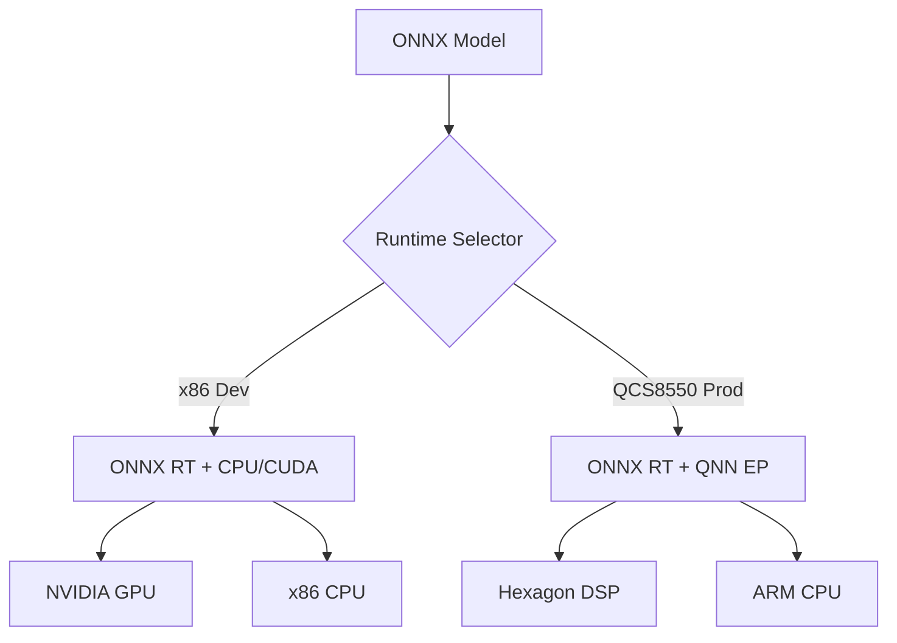

# AI Runtime Specification

## 1. Overview
Defines the strategy for AI/ML inference across x86 development hosts and QCS8550 target hardware, supporting multiple execution providers (CPU, GPU, DSP, NPU).

## 2. Supported Runtimes

### 2.1 ONNX Runtime (Primary)
- **Version**: 1.16.0+
- **License**: MIT
- **Status**: ✅ Validated for Class II devices
- **Execution Providers (EP)**:
  - `CPUExecutionProvider`: Default for x86 and ARM fallback.
  - `CUDAExecutionProvider`: NVIDIA GPUs (development only).
  - `QNNExecutionProvider`: Qualcomm Hexagon DSP/NPU (production target).

### 2.2 TensorRT (Optional)
- **Version**: 8.6.0+
- **Usage**: High-throughput GPU inference on NVIDIA-based variants.
- **Constraint**: Not portable to QCS8550; use only for server-side deployments.

### 2.3 Qualcomm QNN SDK
- **Version**: 2.2.0+
- **Usage**: Direct access to Hexagon DSP for ultra-low latency.
- **Integration**: Accessed via ONNX Runtime QNN EP or native C API.

## 3. Integration Architecture



## 4. Configuration Examples

### 4.1 C++ Session Initialization (QNN)
```cpp
Ort::SessionOptions session_options;
session_options.AppendExecutionProvider_QNN({
    .backend_type = QNN_BACKEND_DSP,
    .precision = QNN_PRECISION_FP16,
    .profiling_enabled = false
});
session_options.SetIntraOpNumThreads(1); // Deterministic threading
session_options.SetGraphOptimizationLevel(GraphOptimizationLevel::ORT_ENABLE_ALL);

auto session = Ort::Session(env, "model.onnx", session_options);
```

### 4.2 Python Session Initialization (CPU Fallback)
```python
import onnxruntime as ort

sess_options = ort.SessionOptions()
sess_options.graph_optimization_level = ort.GraphOptimizationLevel.ORT_ENABLE_ALL
sess_options.intra_op_num_threads = 1

# Try QNN first, fallback to CPU
try:
    sess_options.append_execution_provider("QNN")
except:
    sess_options.append_execution_provider("CPUExecutionProvider")

session = ort.InferenceSession("model.onnx", sess_options)
```

## 5. Performance Targets

| Model Type | Input Size | x86 CPU (ms) | QCS8550 DSP (ms) | Target |
|------------|------------|--------------|------------------|--------|
| Classification (ResNet50) | 224x224 | 12 ms | 4 ms | < 10 ms |
| Detection (YOLOv8n) | 640x640 | 25 ms | 9 ms | < 15 ms |
| Segmentation (UNet) | 512x512 | 45 ms | 14 ms | < 20 ms |
| LLM (TinyLlama) | 1024 tokens | 200 ms | 80 ms | < 100 ms |

## 6. Validation Requirements
1.  **Numerical Accuracy**: Verify FP16 (DSP) vs FP32 (CPU) output divergence < 1%.
2.  **Latency Jitter**: Measure 99th percentile latency over 10,000 inferences.
3.  **Thermal Throttling**: Run sustained inference for 30 mins; ensure no >10% performance drop.

## 7. References
- [ONNX Runtime Execution Providers](https://onnxruntime.ai/docs/execution-providers/)
- [Qualcomm QNN Documentation](https://docs.qualcomm.com/bundle/publicresource/topics/80-63442-1/overview.html)
